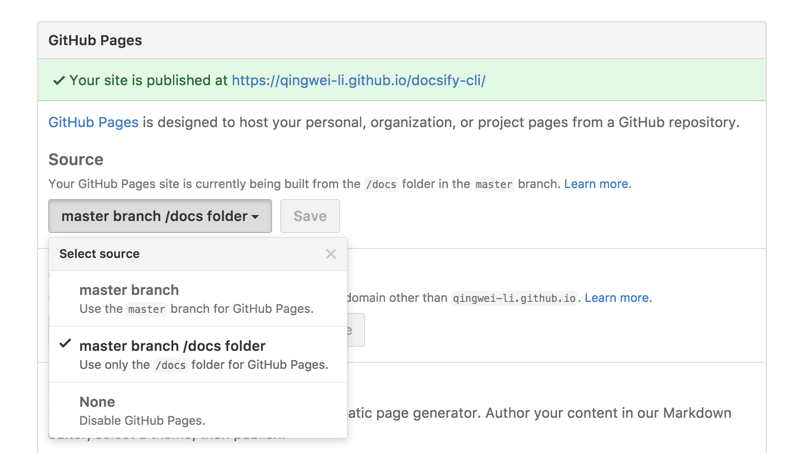

# Docsify 快速入门

> https://docsify.js.org/#/zh-cn/quickstart

## 关于个人博客网站类型的选择

为什么不选择像 Vuepress 或者其他需要预构建的文档网站
1. 发布流程繁琐，每次更新笔记都要重新走一遍打包流程。
2. 难以横向扩展，假如笔记成百上千，更新一篇就要全部重新构建，反复如此，那将是灾难，不符合笔记本身的局部性。
3. 动态内容与静态模板解耦，网站属于静态或者开发框架和应用，笔记属于“数据”，把数据作为网站一部分构建终归差强人意，像CSDN，博客园这样动态返回内容更加符合直觉

## 命令行工具安装

安装 `docsify` 命令行工具

```
pnpm i docsify-cli -g
```

```
qiuliw@X:~/dev/projects/qiuliw-docsify$ npm i docsify-cli -g
npm WARN EBADENGINE Unsupported engine {
npm WARN EBADENGINE   package: 'commander@14.0.3',
npm WARN EBADENGINE   required: { node: '>=20' },
npm WARN EBADENGINE   current: { node: 'v18.19.1', npm: '9.2.0' }
npm WARN EBADENGINE }
npm ERR! code EACCES
npm ERR! syscall mkdir
npm ERR! path /usr/local/lib/node_modules
npm ERR! errno -13
npm ERR! Error: EACCES: permission denied, mkdir '/usr/local/lib/node_modules'
npm ERR!  [Error: EACCES: permission denied, mkdir '/usr/local/lib/node_modules'] {
npm ERR!   errno: -13,
npm ERR!   code: 'EACCES',
npm ERR!   syscall: 'mkdir',
npm ERR!   path: '/usr/local/lib/node_modules'
npm ERR! }
npm ERR! 
npm ERR! The operation was rejected by your operating system.
npm ERR! It is likely you do not have the permissions to access this file as the current user
npm ERR! 
npm ERR! If you believe this might be a permissions issue, please double-check the
npm ERR! permissions of the file and its containing directories, or try running
npm ERR! the command again as root/Administrator.

npm ERR! A complete log of this run can be found in:
npm ERR!     /home/qiuliw/.npm/_logs/2026-06-21T03_29_16_394Z-debug-0.log
```

### 包依赖错误

报错栈指向这一行：

```
/home/qiuliw/.local/share/pnpm/store/v11/links/@/docsify-cli/4.4.4/.../docsify-cli/lib/commands/init.js lines 10-10

const colors = require('ansi-colors')
```

但 docsify-cli@4.4.4 的 package.json 没有声明 ansi-colors 依赖，它只间接出现在 enquirer 里。

你用 pnpm add -g docsify-cli 全局安装后，pnpm 的依赖是严格隔离的：

• 全局目录里只有 docsify-cli 的软链接
• docsify-cli/node_modules/ 里没有 ansi-colors
• init.js 执行 require('ansi-colors') 时找不到模块 → 报错

npm 全局安装通常会把依赖提升（hoist）到上层，所以官方文档里的 npm i docsify-cli -g 往往没问题；pnpm 全局安装则容易踩坑。

解决办法：全局改用 npm

```sh
pnpm remove -g docsify-cli   # 移除有问题的全局安装
npm i docsify-cli -g
```

> 也就是，npm 可以直接使用间接依赖而不用声明导入会依赖提升，pnpm不行依赖严格隔离

### 权限错误

```
npm ERR! The operation was rejected by your operating system.
npm ERR! It is likely you do not have the permissions to access this file as the current user
```

sudo 执行

```sh
sudo npm i docsify-cli -g
```

### 版本警告

```
npm WARN EBADENGINE Unsupported engine {
npm WARN EBADENGINE   package: 'commander@14.0.3',
npm WARN EBADENGINE   required: { node: '>=20' },
npm WARN EBADENGINE   current: { node: 'v18.19.1', npm: '9.2.0' }
```

安装新 Node

```sh
curl -o- https://raw.githubusercontent.com/nvm-sh/nvm/v0.39.7/install.sh | bash
```

```
=> If you wish to uninstall them at a later point (or re-install them under your
=> `nvm` Nodes), you can remove them from the system Node as follows:

     $ nvm use system
     $ npm uninstall -g a_module

=> Close and reopen your terminal to start using nvm or run the following to use it now:

export NVM_DIR="$HOME/.nvm"
[ -s "$NVM_DIR/nvm.sh" ] && \. "$NVM_DIR/nvm.sh"  # This loads nvm
[ -s "$NVM_DIR/bash_completion" ] && \. "$NVM_DIR/bash_completion"  # This loads nvm bash_completion
```

```
nvm -v
```

```
nvm install 24
nvm use 24
```

再次执行

```
npm i docsify-cli -g
```

## 初始化项目

```
docsify init ./docs
```

## 预览网站

```
docsify serve docs
```

```sh
qiuliw@X:~/dev/projects/qiuliw-docsify$ docsify serve docs

Serving /home/qiuliw/dev/projects/qiuliw-docsify/docs now.
Listening at http://localhost:44641
```

## 解析逻辑

所有解析逻辑都来自 `docs/index.html` 内置 JS

```html
<!DOCTYPE html>
<html lang="en">
<head>
  <meta charset="UTF-8">
  <title>Document</title>
  <meta http-equiv="X-UA-Compatible" content="IE=edge,chrome=1" />
  <meta name="description" content="Description">
  <meta name="viewport" content="width=device-width, initial-scale=1.0, minimum-scale=1.0">
  <link rel="stylesheet" href="//cdn.jsdelivr.net/npm/docsify@4/lib/themes/vue.css">
</head>
<body>
  <div id="app"></div>
  <script>
    window.$docsify = {
      name: '',
      repo: ''
    }
  </script>
  <!-- Docsify v4 -->
  <script src="//cdn.jsdelivr.net/npm/docsify@4"></script>
</body>
</html>
```

特点：完全客户端解析

- 不存在打包编译步骤（和 VuePress/VitePress 本质区别）；
- 所有 `.md` 只是原始文本文件，不会提前转 HTML；
- 切换文档、渲染目录、搜索，全部在浏览器通过 index.html 引入的 JS 动态完成；

## 搜索

完全客户端解析，搜索功能由第三方插件提供，默认使用 lunr.js，首次访问会拉取所有文件并清洗留取文档关键词构建索引，后续访问会从缓存中读取。

## GitLab Pages 部署

> https://docsify.js.org/#/zh-cn/deploy

GitHub Pages 支持从三个地方读取文件

`docs/` 目录
master 分支
gh-pages 分支

我们推荐直接将文档放在 `docs/` 目录下，在设置页面开启 **GitHub Pages** 功能并选择 `master branch /docs folder` 选项。

!> 可以将文档放在根目录下，然后选择 master 分支 作为文档目录。你需要在部署位置下放一个 `.nojekyll` 文件（比如 `/docs` 目录或者 gh-pages 分支）

